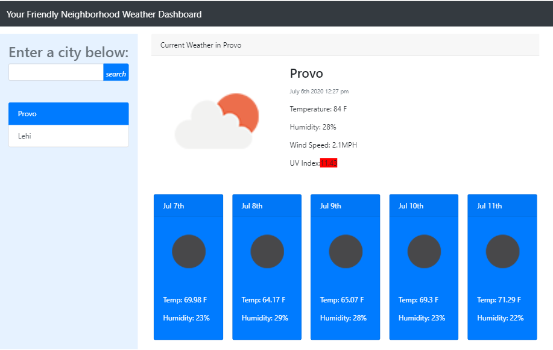
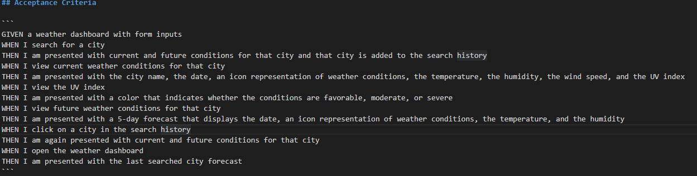

## Ye Olde Weather Dashboard

Welcome to my Weather Dashboard! The purpose of this program is to allow the user to look up the current weather and a five day forecast for a particular city.

### How to Use

Using the Weather Dashboard is simple. Type in the city you wish to search and click the "search" button. The weather information will appear on the right. A button will appear underneath the search bar that will be labeled as the city you have just searched. You can click this button if you wish to review weather information from a previous search.

### Requirements

Here is the acceptance criteria for this particular project.

### What I learned

This project allowed me to experiment more with Bootstrap. While I don't see myself as proficient with it yet, I am far more comfortable using it than I was before, particularly when it comes to cards. I also learned how to use ajax requests properly and exyract information that I need from an api object.

In the future, I may change the design. Currently, i was only trying to emulate the example given. It would be a fun challenge to change and experiment with the design while keeping the same functionality, such as:
* Incorporating the previous search buttons into a dropdown menu.
* Changing the color scheme
* etc.

Enjoy!

[Weather_Dashboard](https://admjeffery.github.io/Weather_Dashboard/)